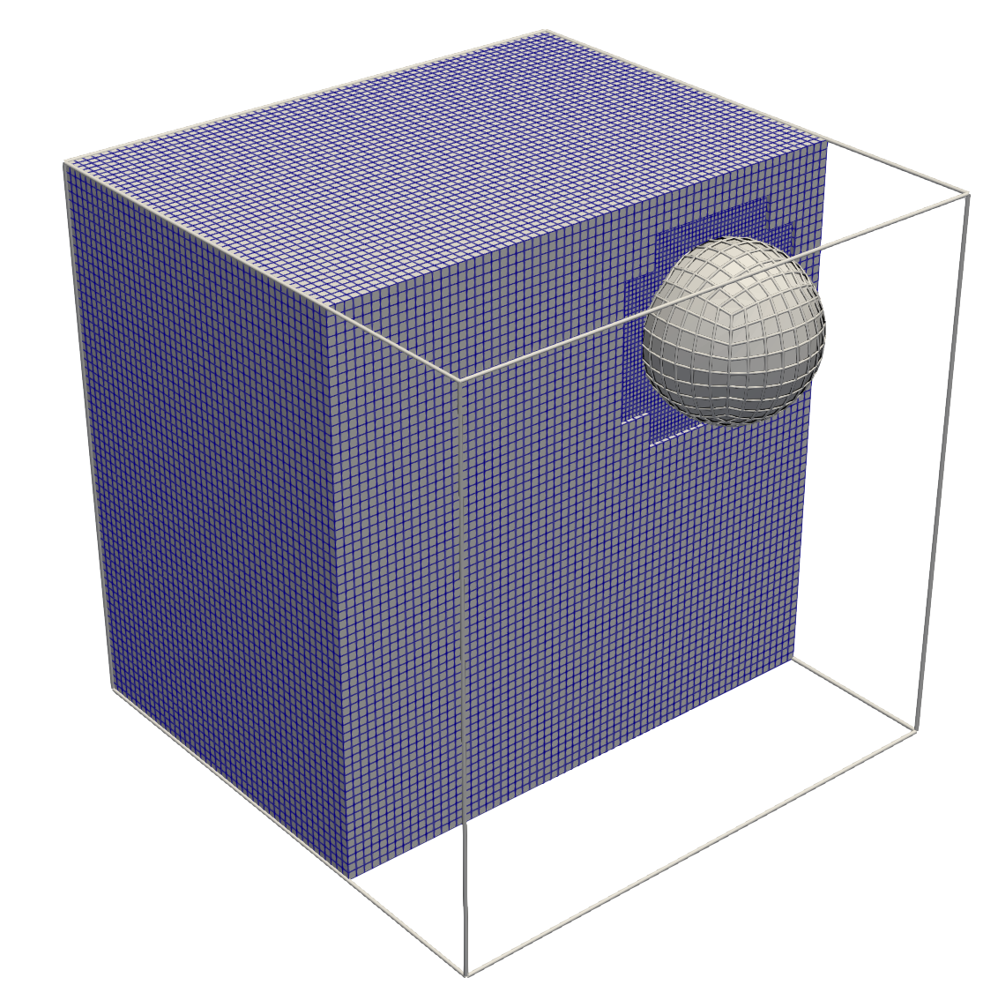
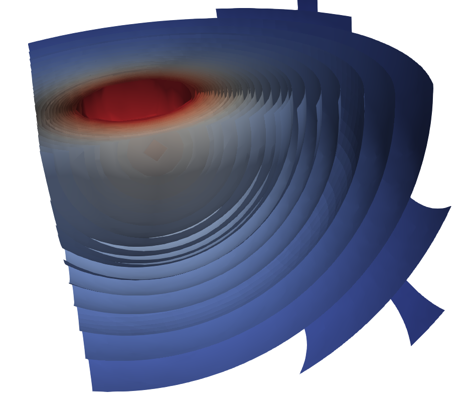

# Non matching test suite

C++ application showing different coupling strategies via non matching finite element techniques such as robust quadrature rules on mesh intersections in co-dimensione one configurations. The executables allow to reproduce the numerical experiments presented in the work `[add_final_title and link]`. 
This builds on top of the integration of the `CGAL` library (https://www.cgal.org/) into `deal.II` (www.dealii.org). Currently, a `deal.II` version greater or equal than `9.4.2` and `CGAL` versions greater than 5.5.2 are required, along with a C++17 compliant compiler.

## How to compile and run

- `mkdir build && cd build`
- `cmake .` , or `cmake -DDEAL_II_DIR=/your/local/path/to/deal/ ..` 
- `make`, or `make -j N`, begin `N` the number of make jobs you may want to ask.

## Using Docker image [TODO]

